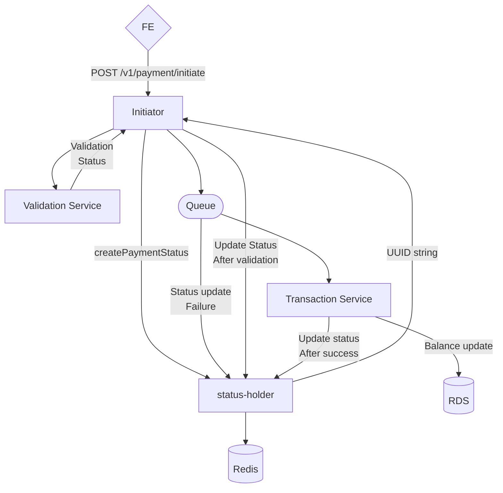

# Online payments service

[](https://sonarcloud.io/summary/new_code?id=mprtcz_payments-service)
[](https://sonarcloud.io/summary/new_code?id=mprtcz_payments-service)
[](https://sonarcloud.io/summary/new_code?id=mprtcz_payments-service)

[//]: # ([![Coverage]&#40;https://sonarcloud.io/api/project_badges/measure?project=mprtcz_payments-service&metric=coverage&#41;]&#40;https://sonarcloud.io/summary/new_code?id=mprtcz_payments-service&#41;)
[](https://sonarcloud.io/summary/new_code?id=mprtcz_payments-service)
[](https://sonarcloud.io/summary/new_code?id=mprtcz_payments-service)
[](https://sonarcloud.io/summary/new_code?id=mprtcz_payments-service)
[](https://sonarcloud.io/summary/new_code?id=mprtcz_payments-service)
[](https://sonarcloud.io/summary/new_code?id=mprtcz_payments-service)
[](https://sonarcloud.io/summary/new_code?id=mprtcz_payments-service)
[](https://sonarcloud.io/summary/new_code?id=mprtcz_payments-service)

A simple service that handles online payments that do not require strong 
consistency for data.

The app can be run with java 21 and maven. 
The endpoint `POST /v1/payment/initiate` can be used to test this simple 
functionality with following sample data:
```
{
  "paymentRequesterAccountNumber": "123456789012345678",
  "paymentDestinationAccountNumber": "123456789012345679",
  "amount": 1
}
```
There are 3 accounts configured in the service ootb:
* `'123456789012345678' with balance 1000.00`
* `'123456789012345679' with balance 500.00`
* `'123456789012345676' with balance 50.00`
* 
And they can be used to transfer money in and out of them.
There are blacklisted accounts that can be used for testing:
* `123456789012345675`
* `876543210987654321`

The initial request comes to `Initiator`, where the validations are 
performed and a transaction ID is obtained. Transaction ID is then used 
throughout the system to identify the transaction status and can be checked 
using `GET /v1/payment/status/{id}` request.

Validation service performs some simple validations asynchronously, which 
can save some time in case the validations are complex or connect to 
multiple slow systems. Not that this module would probably be responsible 
for spring security validations which are omitted in this service for 
simplicity.

In case the validator returns not valid status, the initiator marks status 
as INVALID and stops the transaction. 

If the request is valid, it is sent to a queue that has transaction service 
periodically prompting it for data. If the message on the queue is processed 
more than retry threshold, the transaction is marked as FAILED and the 
message is sent to the DLQ. where can be further analyzed. This would be a 
good alarm candidate as failed transactions can tell a lot about the system 
state. 

Transaction module takes any data that is on the queue and tries to perform 
sql transaction on the RDS. In case the transaction succeeds, it is marked 
as SUCCESS in the status holder and completes.  

Possible extensions: 
* The service is modular, and each module could be a separate service if the 
  usage profile demands it. 
* Some components can be replaced by cloud native services, like status 
  holder's redis can be replaced by cheaper DynamoDb which is also fast, and 
  it is a managed service on AWS which reduced complexity of usage. Moreover,  
  RDS can be replaced by Aurora and Queue can be replaced by SQS
* Monitoring is sorely needed in this app: metrics could be scrapping data 
  about any failed transactions, overall throughput and could serve as basis 
  for statistics. Alerts can be configured to let the team know anything is 
  going wrong, like number of messages on the queue and if there are any on 
  dlq, latency of requests or percentage of failed transactions.
* End-to-end tests were planed initially in `application` module, but the 
  author believes he spent too much time on this service and parts of it are 
  ok-ish covered, so he thinks adding end-to-end would not showcase any 
  additional testing skills. 



